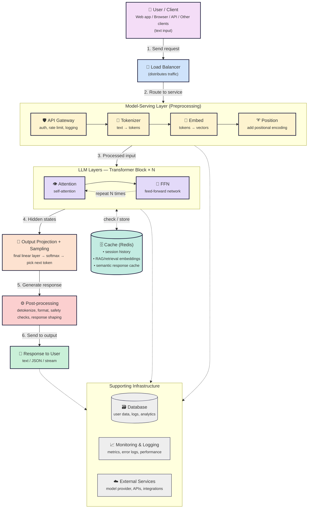

# LLM Workflow

This repo has two companion pieces, each answering a different question:

- **`index.html`** — *What does a language model actually do to my text?*
  An educational, interactive walkthrough of the model-internal pipeline: tokenization, embeddings, attention, and sampling.

- **This README (below)** — *How does a request flow through a production system serving an LLM?*
  An engineering/ops reference diagram: load balancers, caching, monitoring, and the infrastructure around the model.

---

## System Workflow

From input to output — step by step.

**Scalable • Secure • Fast**

## Notes on this version

- **Transformer block wraps Attention + FFN together** (`N ×`), rather than showing them as three sequential steps — a real transformer repeats the *pair*, not each part independently.
- **Cache (Redis)** is labeled for what a Redis-style cache is actually used for in production — session history, retrieval/RAG embeddings, semantic response caching — not the GPU-resident KV-cache used during inference itself, which is a different mechanism.
- **Added an "Output Projection + Sampling" step** between the transformer layers and post-processing, since converting final hidden states into an actual next token (linear layer → softmax → sampling) is a distinct step that was previously skipped.
- **Tokenizer / Embed / Position** are grouped as a "Model-Serving Layer," separate from the API Gateway, since they're part of model input preparation rather than generic backend infrastructure.

> This diagram uses [Mermaid](https://mermaid.js.org/), which GitHub renders natively — just keep this file as `README.md` (or embed the code block in any README) and it will display as a diagram automatically.
